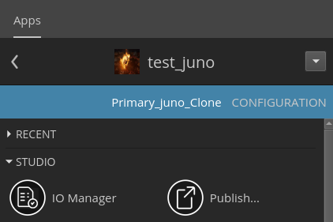

# tk-desktop-iomanager

`tk-desktop-iomanager` is an app available within the ShotGrid Desktop App, which allows for easy version management through Excel files.

## Table of Contents

- [Introduction](#introduction)
- [Features](#features)
- [Installation](#installation)
- [Environments](#environments)
- [Configuration](#configuration)
- [Contributing](#contributing)

## Introduction
`tk-desktop-iomanager` was developed to facilitate easy version management in ShotGrid. 

Users can load, edit, and save Excel files through the app, and compare Excel data with ShotGrid data.

Additionally, based on the Excel data, users can convert videos using `Nuke` API and publish new versions in ShotGrid.

## Environments
`tk-desktop-iomanager` has been developed in this environment.
- Rocky Linux 9.4
- Shotgrid Desktop App 1.8.0
- Rez 3.1.1
- Nuke 15.1v1

## Features
<p align="center">
  
</p>

- Use Excel: You can load and modify Excel files, and save them. Note that the older .xls file format is not supported.

- Validate: It compares and validates checked data with ShotGrid version data, and display in UI

- Publish: Using Nuke, it converts selected data and uploads it to ShotGrid as a new version.

- Other functionalities are currently not implemented.

## Installation

#### You must be prepared for [Shotgrid](https://shotgrid.autodesk.com/)  and Advanced Project Settings in Shotgrid Desktop App to use `tk-desktop-iomanager`!

The official [ShotGrid Developer Help Center](https://help.autodesk.com/view/SGDEV/ENU/) and [Shotgrid Community](https://community.shotgridsoftware.com/) can be helpful.

To utilize the `openpyxl` and `openpyxl-image-loader` modules and the `OCIO` environment variables, a `Rez` package is required.

**If `Rez` is not being used**, you will need to **install these modules** and **set the `OCIO` environment variables**, then **modify `app.py`** accordingly.

```sh
pip install openpyxl
```
```sh
pip install openpyxl-image-loader
```
```sh
export OCIO="/Path/to/your/ocio/config.ocio"
```

## Configuration
To configure `tk-desktop-iomanager`, edit the environment yml files located in the `config` directory.

#### 1. Locate where you installed Pipeline Configuration

#### 2. Add app descriptor section to `config/env/includes/app_locations.yml`:

```yaml
apps.tk-desktop-iomanager.location:
  type: git
  name: tk-desktop-iomanager
  path: "github.com/junopark00/tk-desktop-iomanager.git"
```

#### 3. Then, add app location to `config/env/includes/settings/tk-desktop.yml`:

```yaml
includes:
- ../app_locations.yml
- ../engine_locations.yml
- ./tk-multi-launchapp.yml
- ./tk-multi-publish2.yml
- ./tk-multi-screeningroom.yml

# project
settings.tk-desktop.project:
  apps:
    tk-desktop-iomanager:
      location: "@apps.tk-desktop-iomanager.location"
```

#### 4. Update the apps using the `tank` command in your Pipeline Configurations folder:

```sh
./tank cache_apps
```

#### If the app is successfully recognized, you will see the tk-desktop-iomanager icon in the ShotGrid Desktop App.
<p align="center">
  
</p>


## Contributing
Welcome contributions to tk-desktop-iomanager.

To contribute:
1. Fork the repository.
2. Create a new branch (git checkout -b feature/your-feature-name).
3. Make your changes.
4. Commit your changes (git commit -m 'Add some feature').
5. Push to the branch (git push origin feature/your-feature-name).
6. Open a pull request.
